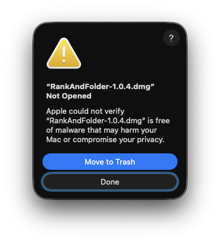
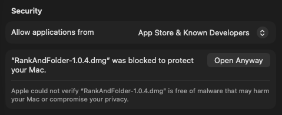
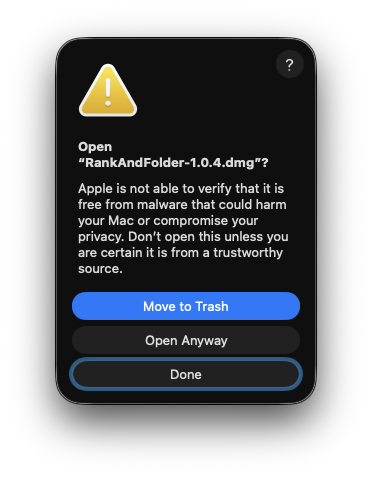
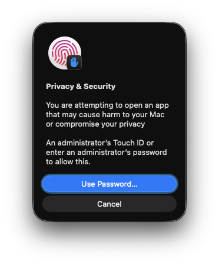
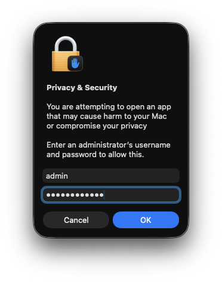
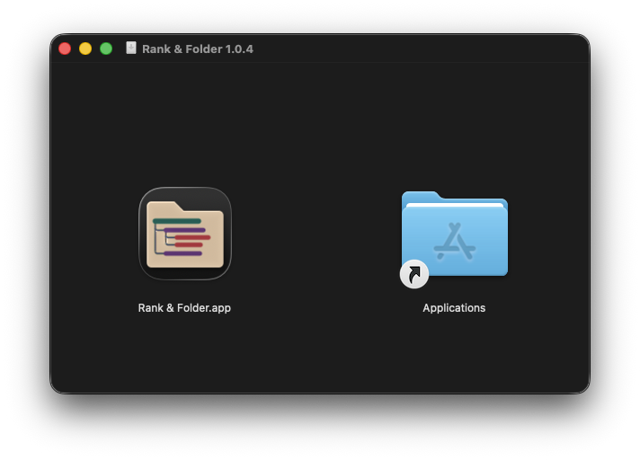

<div align="left">

# Rank & Folder

[](LICENSE)
[](#requirements)
[](https://github.com/drabhikroy/rank-and-folder/releases)

</div>

Save a different way to group and sort each folder.

Everything runs on your Mac. No account is required, no server is used,
and your files are never moved, renamed, or read.


## What it does

Finder gives you one grouping and one sort at a time. Change it for your
downloads and you have changed it for your invoices too.

Rank & Folder remembers a separate layout for every folder you save. Open a
folder and its own arrangement is there. Open a different one and so is that
folder's.

A layout has two parts that do different jobs:

- **Sections** split the folder into headings. Group by kind, then by date
  added, and you get dated headings inside each kind. Up to seven levels.
- **Item order** decides what comes first inside the smallest section. Newest
  first, largest first, name in reverse. Up to seven levels.

Finder can reproduce one Section and one Item Order rule. Anything deeper is
shown as a read-only preview inside the app, and your files are never touched
either way.

## What it does not do

Rank & Folder never moves, renames, or deletes a file, and it never reads file
contents. It reads the same attributes Finder already shows in a list view:
name, kind, dates, size, and tags.

It asks for no Full Disk Access, no Screen Recording, no Input Monitoring, no
camera, no microphone, no contacts, no calendars, and no location.

## Requirements

macOS 14 or later. Apple silicon or Intel.

Two things are optional and both are off until you turn them on:

| Feature | Needs | Without it |
| --- | --- | --- |
| Applying a layout to Finder | Accessibility permission | The app still saves layouts and shows previews |
| Suggested layouts | A local model through Ollama | You build every layout yourself |

## Install

Download the disk image from
[Releases](https://github.com/drabhikroy/rank-and-folder/releases), open it, and
drag **Rank & Folder** onto the Applications shortcut beside it.

A zip is published alongside the disk image for anyone scripting the download.

This build is signed to run on the machine that made it rather than with a paid
Developer ID, so macOS holds it the first time you open it. The warning says
Apple could not verify the file is free of malware. That is what macOS says
about any software it has not seen notarized, including software that is fine.
Check the download against the published checksums first, then allow it.

On macOS 15 and later, including macOS 26, a right-click no longer overrides
this. Six steps, once:

**1. Open the disk image. Choose Done.**

In both this dialog and the one in step 3, **Move to Trash** is the highlighted
button, so pressing Return deletes the download.



**2. Open System Settings, go to Privacy & Security, and scroll to Security. Click Open Anyway.**



**3. Choose Open Anyway again.**



**4. Authenticate with Touch ID, or choose Use Password.**



**5. Enter an administrator name and password.**



**6. Drag Rank & Folder onto the Applications shortcut.**



Open the app from Applications rather than from the disk image. macOS grants
Accessibility permission to one copy at a specific location, so a copy run from
elsewhere is treated as a different program. The app inherits the same hold the
disk image had, so the first launch may ask you to repeat steps 2 through 5 for
the app itself.

On macOS 14, right-click the file, choose **Open**, and confirm.

If you prefer to trust nothing you did not compile, build from source
instead. The steps are under [For developers](#for-developers).

Check the download against the published checksums:

```bash
shasum -a 256 -c SHA256SUMS.txt
```

## Local model

Layout suggestions are optional and run on your Mac through Ollama. Nothing is
sent anywhere. The app talks only to `127.0.0.1` and refuses any redirect that
leaves it.

What the model receives is a count summary: how many files of each kind, which
date and size ranges appear, how many folders, and which tags are in use. It
never receives filenames or file contents. What comes back is checked against a
fixed list of criteria before it can become a layout, and you review the result
before saving it.

You can point the app at an Ollama you already run, or let it install a pinned
copy into its own support folder, verified by checksum and left entirely separate
from any system-wide install.

## Accessibility

- Four color vision settings: standard colors, red-green color vision
  deficiency, blue-yellow color vision deficiency, and complete color vision
  deficiency. The setting drives the whole palette rather than status colors
  alone
- Three text sizes, standard, larger, and largest. Larger is the default
- Light, dark, and system appearance
- Onboarding animation is suppressed when Reduce Motion is on
- Labels, hints, and traits on controls throughout for VoiceOver

## How it works

Rank & Folder drives the same View Options controls you would click yourself,
through the public Accessibility API. There is no private API, no injected code,
and no Finder plugin doing the work.

A saved folder is identified by a bookmark and a filesystem identifier, not by
its path text. A folder deleted and recreated at the same path is treated as a
different folder, and a layout is never applied to a folder the app cannot
positively identify.

Subfolders can inherit a layout, and any subfolder can be marked as an exception
that is left alone. When several saved layouts could apply, the closest one wins,
and anything ambiguous stops rather than guessing.

See [Docs/Architecture.md](Docs/Architecture.md) for the full picture.

## For developers

### Running from source

```bash
git clone https://github.com/drabhikroy/rank-and-folder.git
cd rank-and-folder

# Core logic and its tests, no Xcode project needed
swift test

# The app itself
open RankAndFolder.xcodeproj
```

Set the bundle identifier, App Group, and signing team in `Config/Base.xcconfig`
before running, or the Finder extension and the shared preference suite will not
line up.

To produce the same disk image and zip the releases carry:

```bash
brew install librsvg      # renders the icon
./Scripts/build-standalone.sh
```

Both land in `dist/`, with a `SHA256SUMS.txt` beside them.

### Documentation

| Document | Covers |
| --- | --- |
| [Architecture](Docs/Architecture.md) | How resolution, identity, and the extension fit together |
| [Interface design](Docs/Interface-Design.md) | Palette, contrast ratios, and color vision modes |
| [Apple API constraints](Docs/Apple-API-Constraints.md) | What Finder does and does not expose, and why |
| [Security review](Docs/Security-Review.md) | Threat model and what was checked |
| [Distribution](Docs/Distribution.md) | How releases are built and signed |
| [Privacy](PRIVACY.md) | Every piece of data the app reads or stores |
| [Security policy](SECURITY.md) | How to report a vulnerability |

## Contributing

Conventions, tests, and house writing rules are in
[CONTRIBUTING.md](CONTRIBUTING.md).

## Releases

What changed in each release is in [CHANGELOG.md](CHANGELOG.md).

Disk images and zips are published on the
[Releases](https://github.com/drabhikroy/rank-and-folder/releases) page,
each with a `SHA256SUMS.txt` beside it.

## License

[PolyForm Noncommercial License 1.0.0](LICENSE). The full text is also at
<https://polyformproject.org/licenses/noncommercial/1.0.0>.

Personal use, personal study, hobby projects, teaching, academic research, and
use by charitable, educational, nonprofit, public research, public health, and
government organizations are permitted. Commercial use is not permitted without
a separate license.

Required notice: Copyright 2026 Abhik Roy.
