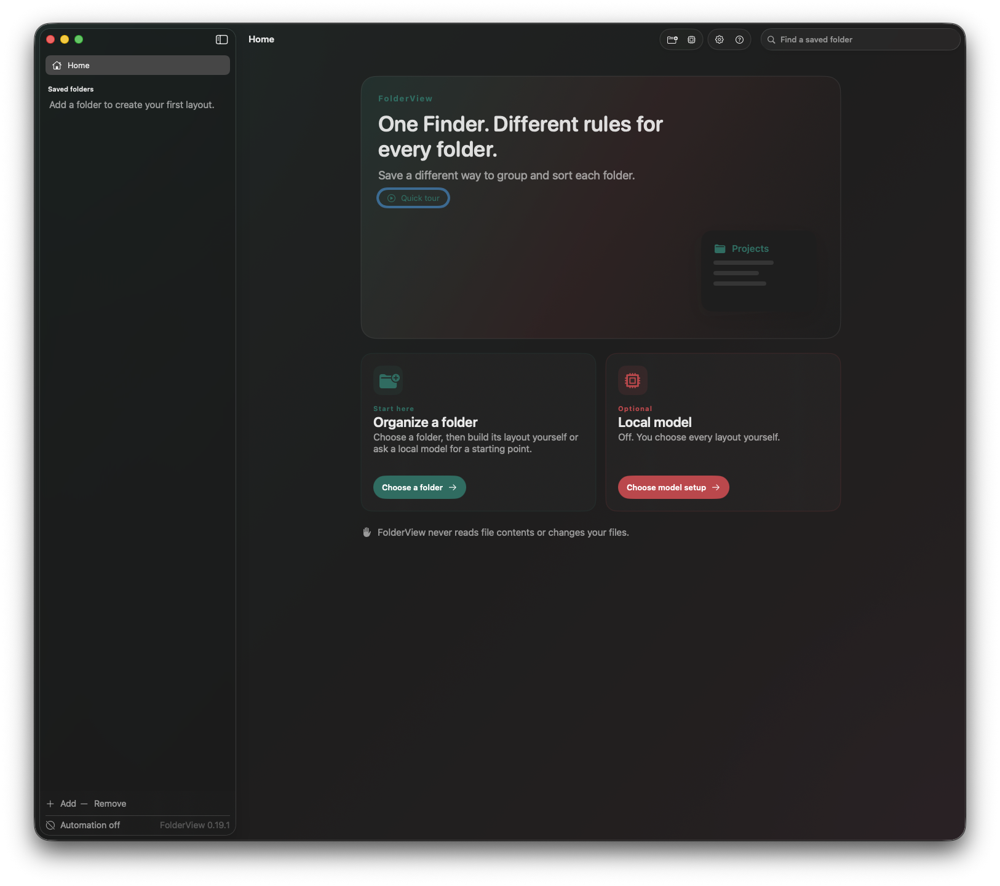

<div align="left">

# Rank & Folder

[](LICENSE)
[](#requirements)
[](https://github.com/drabhikroy/rank-and-folder/releases)

</div>

Save a different way to group and sort each folder.



## What it does

Finder gives you one grouping and one sort at a time. Change it for your
downloads and you have changed it for your invoices too.

Rank & Folder remembers a separate layout for every folder you save. Open a
folder and its own arrangement is there. Open a different one and so is that
folder's.

A layout has two parts that do different jobs:

- **Sections** split the folder into headings. Group by kind, then by date
  added, and you get dated headings inside each kind. Up to seven levels.
- **Item order** decides what comes first inside the smallest section. Newest
  first, largest first, name in reverse. Up to seven levels.

Finder can reproduce one Section and one Item Order rule. Anything deeper is
shown as a read-only preview inside the app, and your files are never touched
either way.

## What it does not do

Rank & Folder never moves, renames, or deletes a file, and it never reads file
contents. It reads the same attributes Finder already shows in a list view:
name, kind, dates, size, and tags.

It asks for no Full Disk Access, no Screen Recording, no Input Monitoring, no
camera, no microphone, no contacts, no calendars, and no location.

## Install

Download the disk image from
[Releases](https://github.com/drabhikroy/rank-and-folder/releases), open it, and
drag **Rank & Folder** onto the Applications shortcut beside it.

A zip is published alongside the disk image for anyone scripting the download.

The build is signed to run on the machine that made it rather than with a paid
Developer ID, so macOS will hold it on first launch. Right-click the app, choose
Open, then confirm. You only do this once. If you prefer to trust nothing you
did not compile, build from source instead.

Check the download against the published checksums:

```sh
shasum -a 256 -c SHA256SUMS.txt
```

<details>
<summary>Build from source</summary>

```sh
git clone https://github.com/drabhikroy/rank-and-folder.git
cd rank-and-folder

# Core logic and its tests, no Xcode project needed
swift test

# The app itself
open RankAndFolder.xcodeproj
```

Set the bundle identifier, App Group, and signing team in `Config/Base.xcconfig`
before running, or the Finder extension and the shared preference suite will not
line up.

To produce the same disk image and zip the releases carry:

```sh
brew install librsvg      # renders the icon
./Scripts/build-standalone.sh
```

Both land in `dist/`, with a `SHA256SUMS.txt` beside them.

</details>

## Requirements

macOS 14 or later. Apple silicon or Intel.

Two things are optional and both are off until you turn them on:

| Feature | Needs | Without it |
| --- | --- | --- |
| Applying a layout to Finder | Accessibility permission | The app still saves layouts and shows previews |
| Suggested layouts | A local model through Ollama | You build every layout yourself |

## How it works

Rank & Folder drives the same View Options controls you would click yourself,
through the public Accessibility API. There is no private API, no injected code,
and no Finder plugin doing the work.

A saved folder is identified by a bookmark and a filesystem identifier, not by
its path text. A folder deleted and recreated at the same path is treated as a
different folder, and a layout is never applied to a folder the app cannot
positively identify.

Subfolders can inherit a layout, and any subfolder can be marked as an exception
that is left alone. When several saved layouts could apply, the closest one wins,
and anything ambiguous stops rather than guessing.

See [Docs/Architecture.md](Docs/Architecture.md) for the full picture.

## Local model

Layout suggestions are optional and run on your Mac through Ollama. Nothing is
sent anywhere. The app talks only to `127.0.0.1` and refuses any redirect that
leaves it.

What the model receives is a count summary: how many files of each kind, which
date and size ranges appear, how many folders, and which tags are in use. It
never receives filenames or file contents. What comes back is checked against a
fixed list of criteria before it can become a layout, and you review the result
before saving it.

You can point the app at an Ollama you already run, or let it install a pinned
copy into its own support folder, verified by checksum and left entirely separate
from any system-wide install.

## Documentation

| Document | Covers |
| --- | --- |
| [Architecture](Docs/Architecture.md) | How resolution, identity, and the extension fit together |
| [Interface design](Docs/Interface-Design.md) | Palette, contrast ratios, and color vision modes |
| [Apple API constraints](Docs/Apple-API-Constraints.md) | What Finder does and does not expose, and why |
| [Security review](Docs/Security-Review.md) | Threat model and what was checked |
| [Distribution](Docs/Distribution.md) | How releases are built and signed |
| [Privacy](PRIVACY.md) | Every piece of data the app reads or stores |
| [Security policy](SECURITY.md) | How to report a vulnerability |
| [Contributing](CONTRIBUTING.md) | Conventions, tests, and house writing rules |
| [Changelog](CHANGELOG.md) | What changed in each release |

## License

[PolyForm Noncommercial License 1.0.0](LICENSE). Free for personal use,
research, education, charities, and government. Commercial use is not permitted.

Copyright 2026 Abhik Roy.
